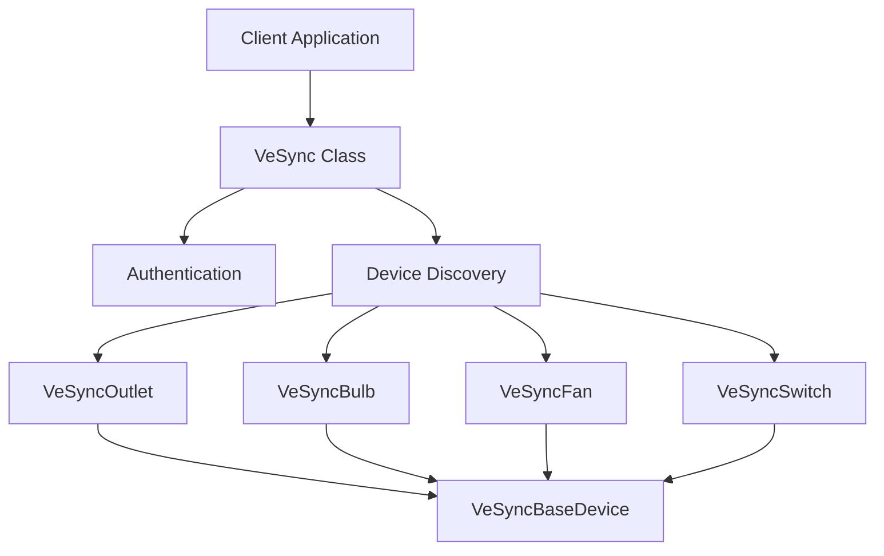
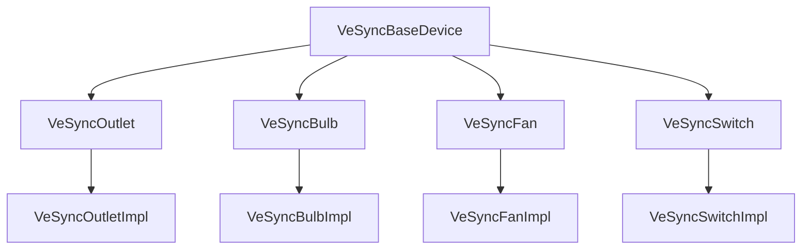
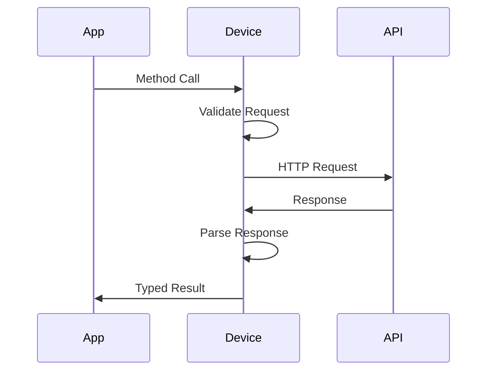
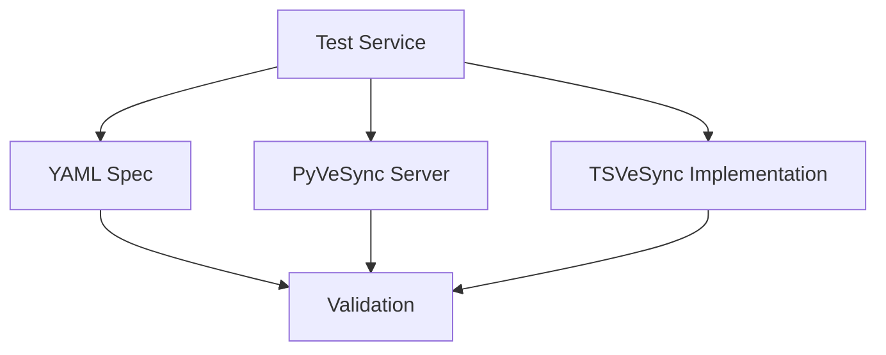

# System Patterns

## Architecture Overview

## Core Design Patterns

### 1. Base Device Pattern
- `VeSyncBaseDevice` abstract class
- Common device functionality
- Shared authentication handling
- Base API methods

### 2. Implementation Inheritance

### 3. Factory Pattern
- Device discovery system
- Dynamic class instantiation
- Model-specific implementations

### 4. Specification Pattern
- YAML-driven implementation
- Strict conformance checking
- Validation-first development

## Key Technical Patterns

### 1. API Communication

### 2. Error Handling
- Consistent error types
- PyVeSync-compatible errors
- Detailed error information
- Type-safe error handling

### 3. Type System
- Interface-first design
- Strict null checking
- Comprehensive type definitions
- Generic type constraints

## Implementation Rules

### 1. YAML Specification Compliance
- Exact URL matching
- Identical request structure
- Matching response handling
- Header conformance

### 2. Type Safety
- No type assertions
- Complete interface coverage
- Strict null checks
- Generic constraints

### 3. Error Management
- Consistent error types
- Proper error propagation
- Detailed error context
- Recovery patterns

## Testing Patterns

### 1. Validation Testing

### 2. Type Testing
- Interface compliance
- Null handling
- Edge cases
- Generic constraints

### 3. Integration Testing
- End-to-end flows
- Error scenarios
- Recovery testing
- Performance validation
