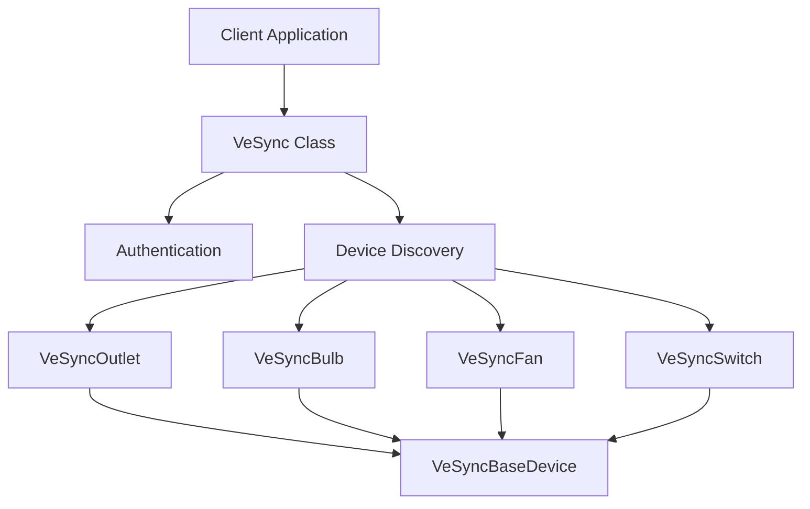
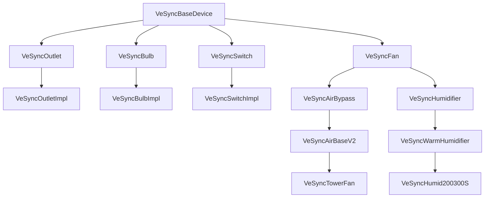
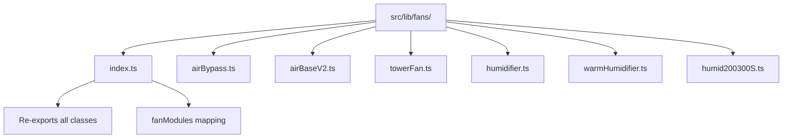
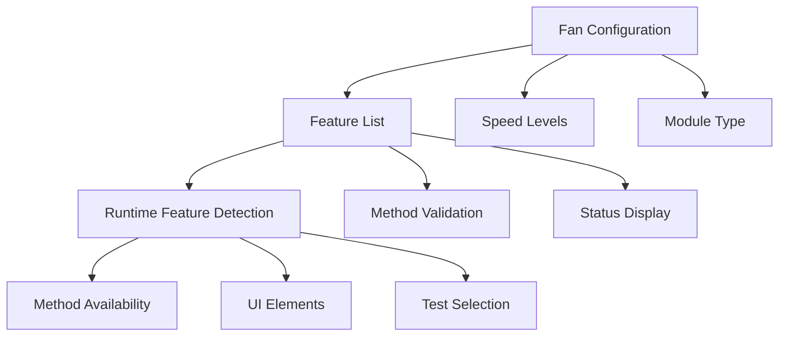
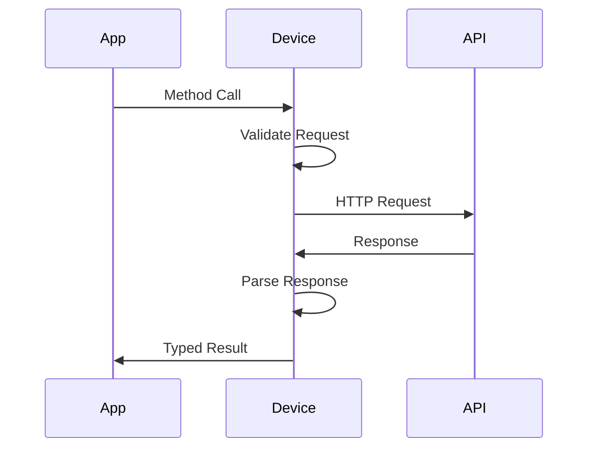
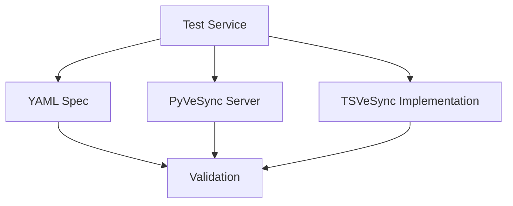

# System Patterns

## Architecture Overview

## Core Design Patterns

### 1. Base Device Pattern
- `VeSyncBaseDevice` abstract class
- Common device functionality
- Shared authentication handling
- Base API methods

### 2. Implementation Inheritance

### 3. Fan Implementation Organization

### 4. Factory Pattern
- Device discovery system
- Dynamic class instantiation
- Model-specific implementations

### 5. Specification Pattern
- YAML-driven implementation
- Strict conformance checking
- Validation-first development
- Device-specific feature configuration:
  * Features defined in fanConfig
  * Inherited through class hierarchy
  * Protected from API response overwrites
  * Used for runtime feature detection

### 6. Configuration Pattern

## Key Technical Patterns

### 1. API Communication

### 2. Error Handling
- Consistent error types
- PyVeSync-compatible errors
- Detailed error information
- Type-safe error handling

### 3. Type System
- Interface-first design
- Strict null checking
- Comprehensive type definitions
- Generic type constraints
- String literal types for status values:
  * 'on' | 'off' for screen status
  * Consistent across inheritance chain
  * Type-safe state management
  * Improved test coverage

## Implementation Rules

### 1. YAML Specification Compliance
- Exact URL matching
- Identical request structure
- Matching response handling
- Header conformance
- Field mapping verification
  * Check both request and response fields
  * Verify virtual vs actual field usage
  * Validate configuration field access

### 2. Feature Support Verification
- Check YAML spec for supported features
- Verify through API response codes
- Remove unsupported features from implementation
- Document feature limitations per model
- Configuration-based feature detection:
  * Features defined in static config
  * Protected from runtime overwrites
  * Used for method validation
  * Drives test behavior

### 2. Type Safety
- No type assertions
- Complete interface coverage
- Strict null checks
- Generic constraints
- String literal types for status values
- Consistent type handling in inheritance

### 3. Error Management
- Consistent error types
- Proper error propagation
- Detailed error context
- Recovery patterns

### 4. Code Organization
- One class per file
- Clear file naming
- Logical directory structure
- Separation of concerns

## Testing Patterns

### 1. Validation Testing

### 2. Type Testing
- Interface compliance
- Null handling
- Edge cases
- Generic constraints

### 3. Integration Testing
- End-to-end flows
- Error scenarios
- Recovery testing
- Performance validation
- Feature support validation
  * Test for unsupported features
  * Verify error codes (e.g. 11000000)
  * Check field mapping correctness
  * Validate configuration usage
