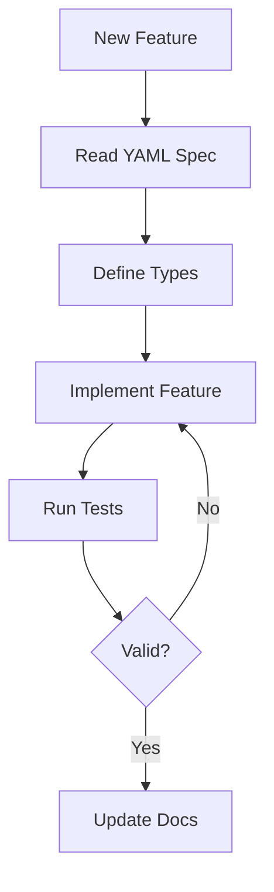

# Technical Context

## Technology Stack

### Core Technologies
1. **TypeScript**
   - Strict type checking enabled
   - ES2020+ target
   - ESM modules
   - Decorators enabled

2. **Node.js**
   - Modern LTS version
   - ESM support
   - Fetch API usage

### Development Tools
1. **Build System**
   - TypeScript compiler (tsc)
   - ESLint for linting
   - Prettier for formatting

2. **Testing Framework**
   - Test service for validation
   - PyVeSync mock server
   - Coverage reporting

## Project Configuration

### TypeScript Configuration
```json
{
  "compilerOptions": {
    "target": "ES2020",
    "module": "ESNext",
    "moduleResolution": "node",
    "strict": true,
    "esModuleInterop": true,
    "skipLibCheck": true,
    "forceConsistentCasingInFileNames": true
  }
}
```

### Dependencies
1. **Production Dependencies**
   - None (Pure TypeScript implementation)

2. **Development Dependencies**
   - TypeScript
   - ESLint
   - Prettier
   - Test service dependencies

## Technical Constraints

### 1. API Compatibility
- Must match PyVeSync exactly (venv/lib/python3.11/site-packages/pyvesync)
- API specifications defined in /api directory
- No additional API endpoints
- Strict request/response matching

### 2. Source of Truth
- PyVeSync Library: venv/lib/python3.11/site-packages/pyvesync
  - Working implementation reference
  - Behavior validation
  - Error handling patterns
  - Runtime verification

- API Specifications: /api directory
  - Complete API contract
  - Request/response formats
  - Device-specific endpoints
  - Required parameters

### 2. Implementation Requirements
- Pure TypeScript/JavaScript
- No external runtime dependencies
- ESM module format

### 3. Type System
- No `any` types allowed
- Strict null checks
- Complete type coverage

## Development Environment

### Required Tools
1. **Node.js**
   - LTS version
   - npm package manager

2. **TypeScript**
   - Latest stable version
   - VSCode integration

3. **Testing Tools**
   - PyVeSync validation server
   - Test service runner

### Development Flow


## API Structure

### 1. Authentication
- Token-based auth
- Session management
- Refresh handling

### 2. Device Management
- Discovery protocol
- Device registration
- Status updates

### 3. Device Control
- Command structure
- Response handling
- Error management

## Security Considerations

### 1. Authentication
- Secure token storage
- Token refresh patterns
- Session management

### 2. Data Handling
- No sensitive data logging
- Secure credential management
- Safe error reporting

### 3. API Security
- HTTPS only
- Token validation
- Request signing

## Performance Requirements

### 1. Response Time
- Fast device discovery
- Quick command execution
- Efficient status updates

### 2. Resource Usage
- Minimal memory footprint
- Efficient network usage
- Optimized processing

### 3. Scalability
- Multiple device handling
- Concurrent operations
- Resource management

## Deployment Considerations

### 1. Package Distribution
- npm package
- Type definitions
- ESM/CommonJS support

### 2. Version Management
- Semantic versioning
- Changelog maintenance
- Breaking change handling

### 3. Documentation
- API documentation
- Type documentation
- Usage examples
