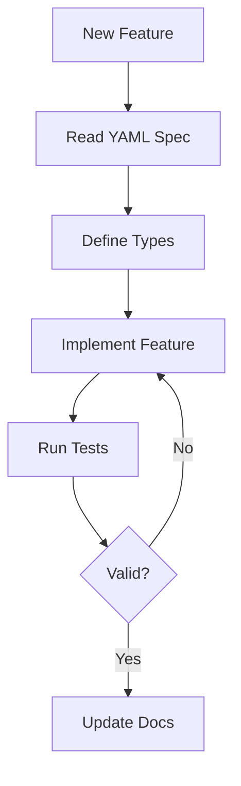

# Technical Context

## Technology Stack

### Core Technologies
1. **TypeScript**
   - Strict type checking enabled
   - ES2020+ target
   - ESM modules
   - Decorators enabled

2. **Node.js**
   - Modern LTS version
   - ESM support
   - Fetch API usage

### Development Tools
1. **Build System**
   - TypeScript compiler (tsc)
   - ESLint for linting
   - Prettier for formatting

2. **Testing Framework**
   - Test service for validation
   - PyVeSync mock server
   - Coverage reporting

## Project Configuration

### TypeScript Configuration
```json
{
  "compilerOptions": {
    "target": "ES2020",
    "module": "ESNext",
    "moduleResolution": "node",
    "strict": true,
    "esModuleInterop": true,
    "skipLibCheck": true,
    "forceConsistentCasingInFileNames": true
  }
}
```

### Dependencies
1. **Production Dependencies**
   - None (Pure TypeScript implementation)

2. **Development Dependencies**
   - TypeScript
   - ESLint
   - Prettier
   - Test service dependencies

## Technical Constraints

### 1. API Compatibility
- Must match PyVeSync exactly (venv/lib/python3.11/site-packages/pyvesync)
- API specifications defined in /api directory
- No additional API endpoints
- Strict request/response matching

### 2. Source of Truth
- PyVeSync Library: venv/lib/python3.11/site-packages/pyvesync
  - Working implementation reference
  - Behavior validation
  - Error handling patterns
  - Runtime verification

- API Specifications: /api directory
  - Complete API contract
  - Request/response formats
  - Device-specific endpoints
  - Required parameters

### 3. Implementation Requirements
- Pure TypeScript/JavaScript
- No external runtime dependencies
- ESM module format
- One class per file
- Clear file organization

### 4. Type System
- No `any` types allowed
- Strict null checks
- Complete type coverage
- Interface-first design

## Project Structure

### Directory Organization
```
/
├── api/                    # YAML specifications (READ ONLY)
│   ├── vesyncbulb/        # Bulb device specs
│   ├── vesyncfan/         # Air purifier specs
│   ├── vesyncoutlet/      # Outlet device specs
│   └── vesyncswitch/      # Switch device specs
├── src/
│   ├── lib/               # Core implementation
│   │   ├── fans/          # Fan implementations
│   │   │   ├── index.ts   # Fan exports & mapping
│   │   │   ├── airBypass.ts
│   │   │   ├── airBaseV2.ts
│   │   │   ├── towerFan.ts
│   │   │   ├── humidifier.ts
│   │   │   ├── warmHumidifier.ts
│   │   │   └── humid200300S.ts
│   │   ├── vesync.ts      # Main VeSync class
│   │   ├── vesyncFan.ts   # Fan base class
│   │   └── vesyncFanImpl.ts # Fan implementation exports
│   └── index.ts           # Main entry point
├── test/                  # Test files
└── docs/                  # Documentation
```

## Development Environment

### Required Tools
1. **Node.js**
   - LTS version
   - npm package manager

2. **TypeScript**
   - Latest stable version
   - VSCode integration

3. **Testing Tools**
   - PyVeSync validation server
   - Test service runner

### Development Flow


## API Structure

### 1. Authentication
- Token-based auth
- Session management
- Refresh handling

### 2. Device Management
- Discovery protocol
- Device registration
- Status updates

### 3. Device Control
- Command structure
- Response handling
- Error management
- Field mapping patterns:
  * Virtual vs actual fields (e.g. mist_virtual_level)
  * Configuration field access (e.g. auto_target_humidity)
  * Response field verification
  * State tracking and updates

### 4. Feature Support
- YAML spec verification
- API error code validation (e.g. 11000000)
- Feature removal for unsupported capabilities
- Model-specific feature documentation
- Feature configuration:
  * Static configuration in fanConfig
  * Device-specific feature lists
  * Protected from runtime overwrites
  * Used for feature detection and validation

## Code Organization

### 1. File Structure
- One class per file
- Clear file naming
- Logical directory structure
- Separation of concerns

### 2. Module Organization
- Feature-based directories
- Index files for exports
- Clear dependency paths
- Backward compatibility

### 3. Implementation Patterns
- Base classes in root
- Implementations in subdirectories
- Shared utilities separate
- Clear inheritance chains
- Configuration inheritance:
  * Static feature config in fanConfig
  * Protected from runtime overwrites
  * Inherited through class hierarchy
  * Used for feature detection
- Feature support verification:
  * Check YAML spec for supported features
  * Validate through API response codes
  * Remove unsupported features from implementation
  * Document feature limitations per model
- Field mapping patterns:
  * Use virtual fields when specified in YAML
  * Access configuration fields for device settings
  * Track both actual and virtual state
  * Update all relevant fields on changes

### 4. Device-Specific Patterns
- Core200S Implementation:
  * Feature configuration in fanConfig
  * Support for fan_speed and auto_mode
  * Display control with 'on'|'off' status
  * State restoration capability
  * Mode control (auto, manual, sleep)
  * Fan speed levels (1-3)

## Security Considerations

### 1. Authentication
- Secure token storage
- Token refresh patterns
- Session management

### 2. Data Handling
- No sensitive data logging
- Secure credential management
- Safe error reporting

### 3. API Security
- HTTPS only
- Token validation
- Request signing

## Performance Requirements

### 1. Response Time
- Fast device discovery
- Quick command execution
- Efficient status updates

### 2. Resource Usage
- Minimal memory footprint
- Efficient network usage
- Optimized processing

### 3. Scalability
- Multiple device handling
- Concurrent operations
- Resource management

## Deployment Considerations

### 1. Package Distribution
- npm package
- Type definitions
- ESM/CommonJS support

### 2. Version Management
- Semantic versioning
- Changelog maintenance
- Breaking change handling

### 3. Documentation
- API documentation
- Type documentation
- Usage examples
